# Mermaid Edge Cases Fixture

Back to [sample mermaid section](./sample.md#mermaid-diagrams).

## Flowchart Label Fit
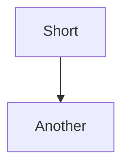
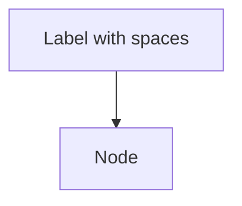
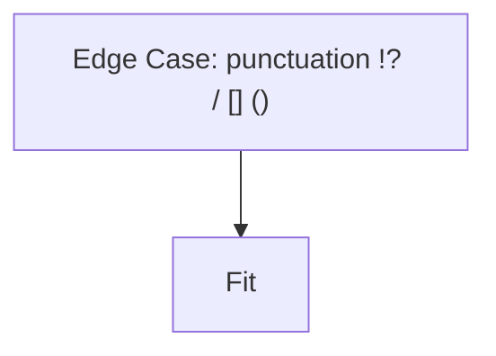
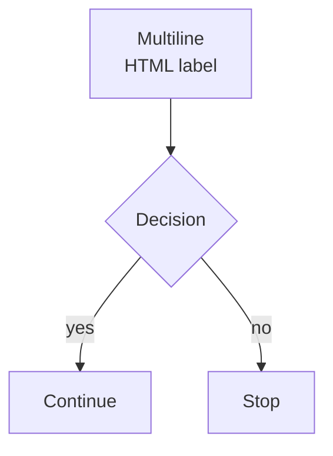

## Flowchart Large and Dense
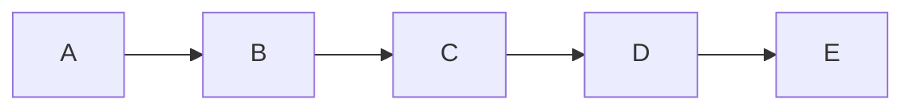
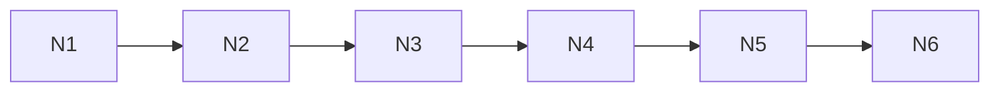
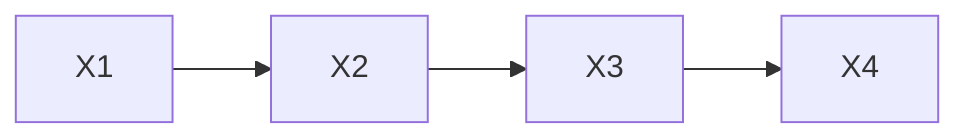
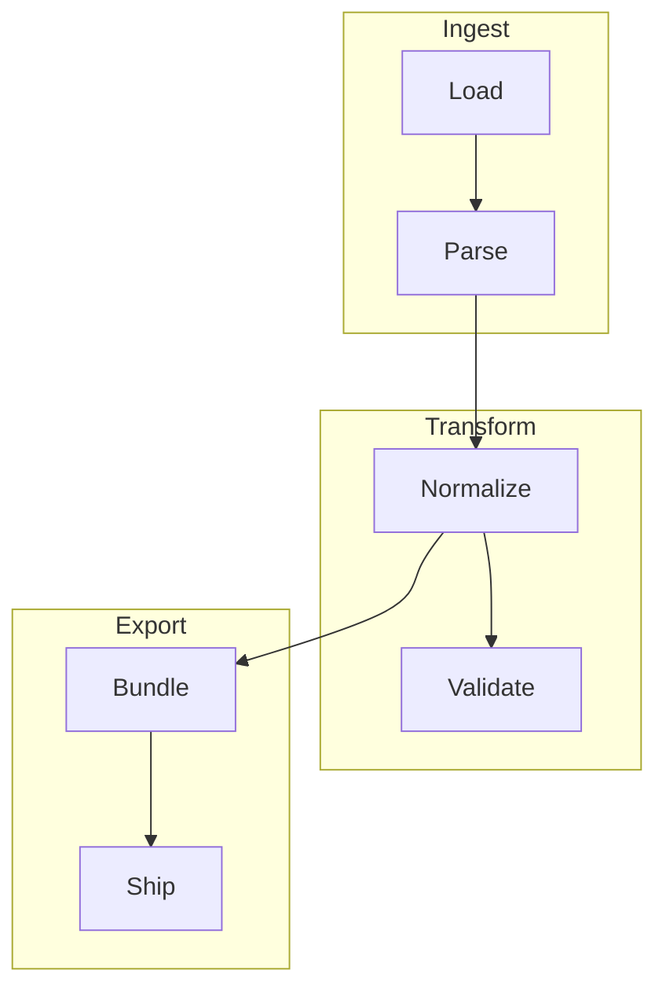

## Sequence Diagram Edge Cases
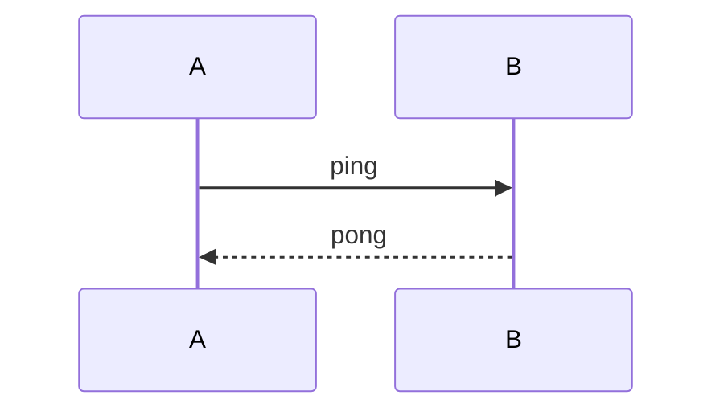
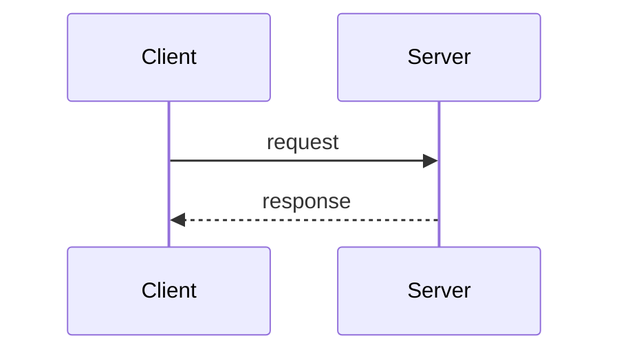
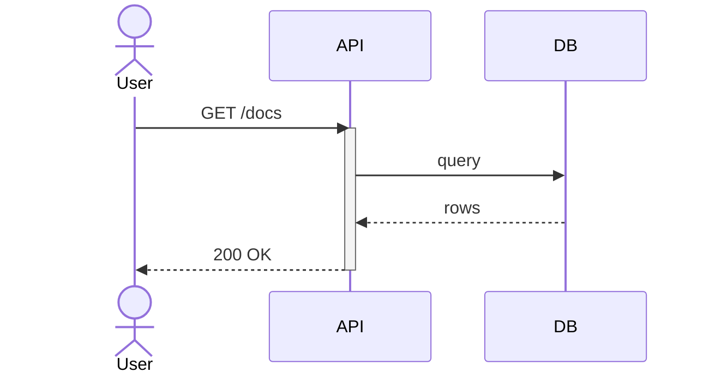
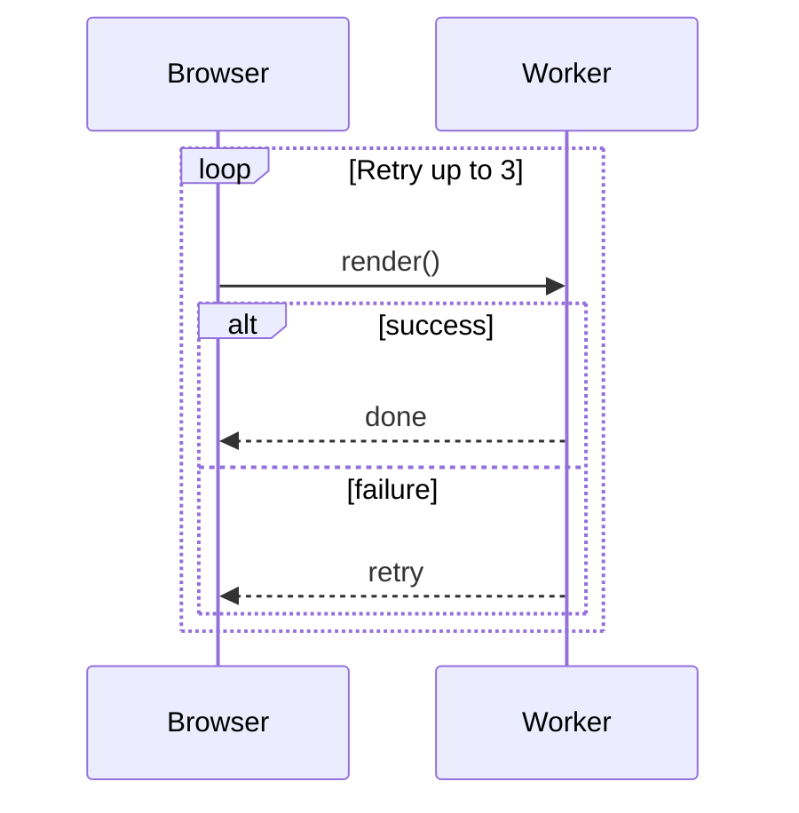

## Class Diagram Edge Cases
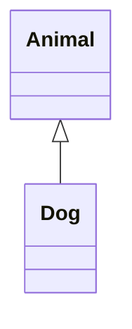
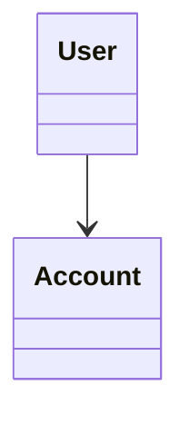
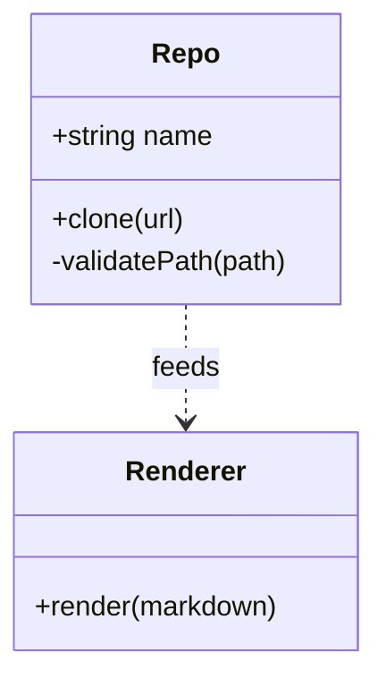

## State Diagram Edge Cases
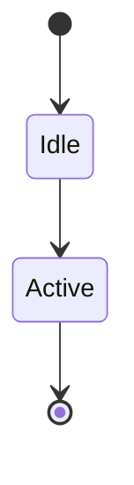
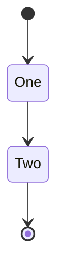
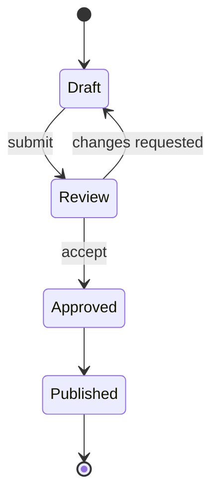

## ER Diagram Edge Cases
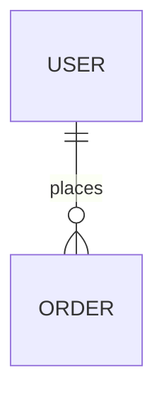
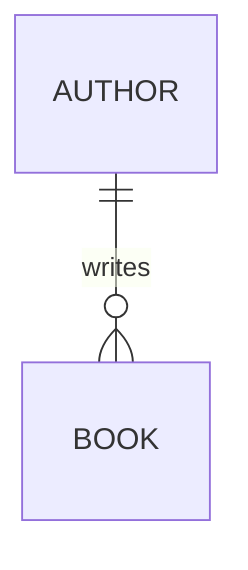
```mermaid
erDiagram
USER {
  int id PK
  string email
}
ORDER {
  int id PK
  int user_id FK
  float total
}
USER ||--o{ ORDER : places
```

## Gantt / Timeline
```mermaid
gantt
title Example
dateFormat YYYY-MM-DD
section Build
Task :a1, 2024-01-01, 1d
```
```mermaid
timeline
title Example
2024 : start
2025 : continue
```
```mermaid
gantt
title Release Plan
dateFormat  YYYY-MM-DD
section Milestones
Design     :done, d1, 2024-01-01, 7d
Implement  :active, d2, after d1, 14d
Verify     :d3, after d2, 10d
```
```mermaid
timeline
title Roadmap
Q1 : alpha
Q2 : beta
Q3 : ga
Q4 : hardening
```

## Pie / Mindmap / Journey / GitGraph
```mermaid
pie
title Coverage
"A" : 50
"B" : 50
```
```mermaid
mindmap
  root((Root))
    Node
```
```mermaid
journey
  title User Flow
  section Authoring
    Open markdown: 5: User
    Edit content: 4: User
  section Preview
    Render diagrams: 4: Extension
    Export PDF: 3: Extension
```
```mermaid
gitGraph
   commit id: "init"
   branch feature/math
   checkout feature/math
   commit id: "add-katex"
   checkout main
   merge feature/math
```

## C4 / Requirement / Charts / Sankey / Block
```mermaid
C4Context
title Offline Markdown Preview System Context
Person(author, "Author")
System(ext, "VS Code Extension")
System_Boundary(b1, "Workspace") {
  System(file, "Markdown Files")
}
Rel(author, ext, "Uses")
Rel(ext, file, "Reads")
```
```mermaid
requirementDiagram
requirement r1 {
  id: REQ1
  text: "render markdown offline"
  risk: medium
  verifyMethod: test
}
element e1 {
  type: software
  docRef: "docs/renderer.md"
}
e1 - satisfies -> r1
```
```mermaid
quadrantChart
  title Test Prioritization
  x-axis low impact --> high impact
  y-axis low confidence --> high confidence
  quadrant-1 monitor
  quadrant-2 prioritize
  quadrant-3 defer
  quadrant-4 automate
  unit tests: [0.75, 0.8]
  e2e tests: [0.9, 0.6]
```
```mermaid
xychart-beta
  title "Render Time (ms)"
  x-axis [small, medium, large]
  y-axis "ms" 0 --> 400
  bar [40, 120, 290]
  line [35, 110, 260]
```
```mermaid
sankey-beta
Markdown,AST,120
AST,HTML,120
HTML,Webview,118
HTML,Export,117
```
```mermaid
block-beta
columns 3
A|Editor|
B|Renderer|
C|Webview|
A --> B --> C
```
