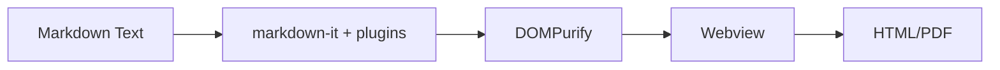
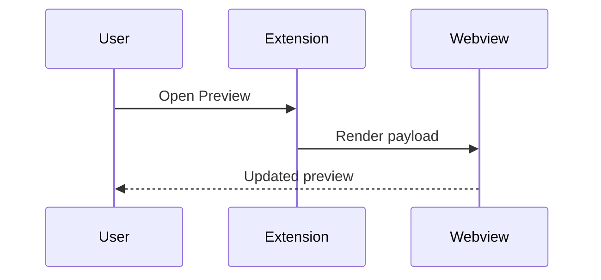
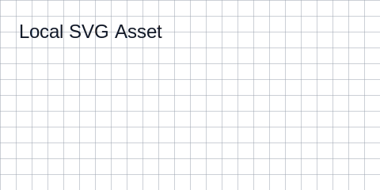

# Sample

This fixture intentionally exercises markdown rendering, syntax highlighting, diagram rendering, math, link handling, and sanitization-sensitive HTML.

## Headings and Anchors

### Level 3 Heading

#### Level 4 Heading

This section exists to test heading extraction, copy heading link behavior, and outline navigation.

## Emphasis and Inline Syntax

Text styles: *italic*, **bold**, ***bold italic***, ~~strikethrough~~, and `inline code`.

Keyboard/input style examples: <kbd>Ctrl</kbd> + <kbd>K</kbd> and escaped markdown: \*not italic\*.

## Lists and Task Lists

- Unordered item A
- Unordered item B
  - Nested item B.1
  - Nested item B.2
- Unordered item C

1. Ordered item 1
2. Ordered item 2
3. Ordered item 3

- [x] Task done
- [ ] Task pending
- [x] Task with **formatting** and `inline code`

## Blockquote and Rule

> Offline-first rendering means preview should work without network access.
>
> Nested quote level:
>> A second quote level.

---

## Tables and Alignment

| Feature | Status | Notes |
|:--|:--:|--:|
| Mermaid | Enabled | Local bundle |
| KaTeX | Enabled | Local bundle |
| Sanitizer | Enabled | Strict allowlist |

## Definition List

Renderer
: Converts markdown into sanitized HTML.

Outline
: Heading tree used for navigation and copy-link actions.

## Code Blocks and Highlighting

```ts
interface PreviewSettings {
  enableMermaid: boolean;
  enableMath: boolean;
  sanitizeHtml: boolean;
}

const defaultSettings: PreviewSettings = {
  enableMermaid: true,
  enableMath: true,
  sanitizeHtml: true
};
```

```json
{
  "name": "offline-markdown-preview",
  "private": true,
  "scripts": {
    "test:e2e": "node ./test/e2e/runVscodeE2E.mjs"
  }
}
```

```bash
npm install
npm run build
npm run test:e2e
```

## HTML and Sanitization Probe

Trusted inline HTML that should remain:

<div data-kind="safe-note"><strong>Safe HTML block</strong> with inline content.</div>

Potentially unsafe HTML that sanitizer should strip or neutralize when enabled:

<script>window.__omv_should_not_run = true;</script>


## Mermaid





## Math

Inline: $a^2+b^2=c^2$, $e^{i\pi}+1=0$, $\alpha+\beta+\gamma=\pi$.

Display:

$$
\int_0^1 x^2\,dx = \frac{1}{3}
$$

$$
\sum_{k=1}^{n} k = \frac{n(n+1)}{2}
$$

Aligned system:

$$
\begin{aligned}
2x + 3y &= 7 \\
4x - y &= 5
\end{aligned}
$$

Matrix:

$$
A = \begin{bmatrix}
1 & 2 & 3 \\
0 & 1 & 4 \\
5 & 6 & 0
\end{bmatrix}
$$

Piecewise:

$$
f(x)=
\begin{cases}
x^2, & x < 0 \\
\sin(x), & 0 \le x < \pi \\
\ln(x), & x \ge \pi
\end{cases}
$$

## Footnotes

Footnote reference one[^note1] and another[^note2].

[^note1]: First footnote content.
[^note2]: Second footnote with `inline code`.

## Links and Assets Offline Safe

- [Linked Doc](./linked-doc.md)
- [Linked Subdoc](./sub/linked-subdoc.md)
- [Mermaid Edge Cases](./mermaid-edge-cases.md)
- [Heading Anchor](#mermaid-diagrams)
- [External Link (example.com)](https://example.com)




## Mermaid Diagrams

This section is linked by edge-case fixtures.

## Final Checklist

- [x] Headings and anchors
- [x] Emphasis and inline code
- [x] Lists and tasks
- [x] Tables and definition lists
- [x] Code highlighting
- [x] Sanitization probe
- [x] Mermaid diagrams
- [x] Math rendering
- [x] Footnotes
- [x] Relative links and local images
