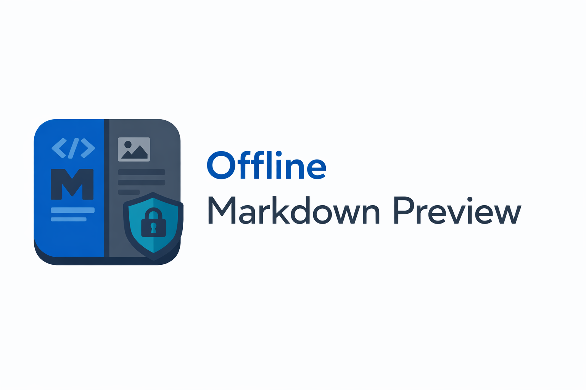

# Offline Markdown Preview

Offline Markdown preview for VS Code with Mermaid diagrams, KaTeX math, secure local rendering, export, scroll sync, and outline navigation.

**Offline + Secure**: runs locally inside VS Code and the extension does not send your Markdown contents anywhere (no cloud, no telemetry).

## GIF Demos

A quick tour of key workflows (all offline, inside VS Code):

<table>
  <tr>
    <td width="50%" valign="top">
      <strong>Live preview + scroll sync</strong> 
      
    </td>
    <td width="50%" valign="top">
      <strong>Mermaid + math rendering</strong> 
      
    </td>
  </tr>
  <tr>
    <td width="50%" valign="top">
      <strong>Outline + heading navigation</strong> 
      
    </td>
    <td width="50%" valign="top">
      <strong>Remote image download + cache</strong> 
      
    </td>
  </tr>
</table>

## What You Get

- **Free**: no paywalls; MIT-licensed.
- **Offline + secure by design**: render/preview/export works locally with bundled libraries (no CDN, no remote fonts, no telemetry).
- **Secure webview defaults**: strict CSP + HTML sanitization (`DOMPurify`) enabled by default.
- **Markdown preview panel** with live updates and editor/preview scroll sync.
- **Bundled rendering stack**: Mermaid diagrams, KaTeX math, Prism syntax highlighting.
- **Navigation tools**: Markdown outline TreeView, heading quick pick, copy heading links.
- **Export tools**: HTML export and PDF export from the preview workflow.
- **Safety controls**: external-link confirmation, image size limits, sanitization toggle (with explicit unsafe wording).

## Quick Start

1. Open a Markdown file (`.md`) in VS Code.
2. Preview opens automatically by default (`offlineMarkdownViewer.preview.autoOpen = true`) when a Markdown editor becomes active.
3. You can also run **Offline Markdown Preview: Open Preview** (or **Open Preview To Side**) manually.
4. Use the outline view and heading commands to navigate larger documents.
5. Export when needed with **Export HTML** or **Export PDF**.

Tip: use the editor title action to open preview to the side while editing.

## Privacy, Offline, and Data Safety

- **No network required** for render, preview, or export.
- **No telemetry** and no document-content upload.
- **Remote web requests are blocked** in the webview runtime (`fetch`, `XMLHttpRequest`, `WebSocket`, `EventSource`) for `http(s)` targets.
- **Remote images are blocked by default**; you can opt in via `offlineMarkdownViewer.preview.allowRemoteImages`.
- **When remote images are blocked**, each remote image gets a **Download Image** action that caches it locally and replaces it in preview.
- **Strict CSP** includes `connect-src 'none'`.
- **Sanitization is on by default** (`offlineMarkdownViewer.sanitizeHtml = true`).
- **Export writes files only on explicit user action** (HTML/PDF commands).

## Settings

These VS Code settings control rendering, safety, and performance:

- `offlineMarkdownViewer.enableMermaid` (default: `true`): enable Mermaid rendering (bundled locally).
- `offlineMarkdownViewer.enableMath` (default: `true`): enable KaTeX math rendering (bundled locally).
- `offlineMarkdownViewer.scrollSync` (default: `true`): synchronize editor and preview scrolling.
- `offlineMarkdownViewer.sanitizeHtml` (default: `true`): sanitize rendered HTML in the webview; turning this off is unsafe.
- `offlineMarkdownViewer.externalLinks.confirm` (default: `true`): confirm before opening external links.
- `offlineMarkdownViewer.preview.autoOpen` (default: `true`): auto-open/reuse preview when a Markdown editor becomes active.
- `offlineMarkdownViewer.preview.allowRemoteImages` (default: `false`): allow loading remote `http(s)` images in preview. When off, remote images are shown as a download action and cached locally for preview use.
- `offlineMarkdownViewer.preview.maxImageMB` (default: `8`): maximum local image size loaded into preview.
- `offlineMarkdownViewer.export.embedImages` (default: `false`): embed local images as data URIs for HTML export (privacy warning shown).
- `offlineMarkdownViewer.performance.debounceMs` (default: `120`): debounce delay for live preview updates.
- `offlineMarkdownViewer.preview.globalCustomCssPath` (default: `""`): absolute path to a user-level `.css` file appended to every preview.
- `offlineMarkdownViewer.preview.customCssPath` (default: `""`): workspace-relative `.css` file appended after the global stylesheet. Set this in workspace or folder settings to override the global baseline for a repo.
- `offlineMarkdownViewer.preview.showFrontmatter` (default: `false`): show parsed YAML frontmatter above the rendered document.

## Custom CSS

Use `offlineMarkdownViewer.preview.globalCustomCssPath` in user settings to apply a stylesheet everywhere, then optionally layer `offlineMarkdownViewer.preview.customCssPath` in a workspace for repo-specific tweaks.

If both are set, the global stylesheet is injected first and the workspace stylesheet is injected second, so workspace rules win on conflicts.

You can also run **Offline Markdown Preview: Set Custom CSS** from the Command Palette to pick a global or workspace stylesheet without editing settings JSON manually.

For a full setup guide, example CSS, and GitHub-style walkthrough, see [docs/custom-css/README.md](docs/custom-css/README.md).

## Commands

| Command                                                   | Purpose                                          |
| --------------------------------------------------------- | ------------------------------------------------ |
| `Offline Markdown Preview: Open Preview`                  | Open the Markdown preview panel                  |
| `Offline Markdown Preview: Open Preview To Side`          | Open the preview beside the active editor        |
| `Offline Markdown Preview: Export HTML`                   | Export the current preview/document as HTML      |
| `Offline Markdown Preview: Export PDF`                    | Export the current preview/document as PDF       |
| `Offline Markdown Preview: Set Custom CSS`                | Pick or clear a global/workspace custom CSS file |
| `Offline Markdown Preview: Show Remote Image Cache Usage` | Show current remote-image cache size/file counts |
| `Offline Markdown Preview: Clear Remote Image Cache`      | Delete cached remote images used by preview      |
| `Offline Markdown Preview: Toggle Scroll Sync`            | Enable/disable editor <-> preview scroll sync    |
| `Offline Markdown Preview: Copy Heading Link`             | Copy a heading anchor link (outline context)     |
| `Offline Markdown Preview: Quick Pick Heading`            | Jump to a heading via quick pick                 |

## Remote Image Cache

Remote images downloaded from blocked placeholders are cached locally for offline-safe preview reuse.

- Workspace cache path: `.offline-markdown-preview/remote-images` (inside each workspace folder).
- Global fallback cache path: VS Code extension global storage (`bowlerr.offline-markdown-preview/remote-images`) when no workspace folder is available.
- Use **Offline Markdown Preview: Show Remote Image Cache Usage** to inspect total size/count.
- Use **Offline Markdown Preview: Clear Remote Image Cache** to remove cached remote images.

## Keybindings (VS Code)

No extension-level VS Code keybindings are registered by default (nothing is contributed in `package.json`).
You can add your own command shortcuts in VS Code if desired.

Preview-local shortcuts (when focus is inside the preview webview):

- `Cmd/Ctrl+F`: open/focus preview search
- `Enter` (in search box): next match

## Notes, Limits, and Safety

- **Sanitization can be disabled** for advanced cases, but this is unsafe for untrusted Markdown/HTML content.
- **Paths outside the workspace may be blocked** for preview safety when resolving local resources.
- **Large images are capped** by `offlineMarkdownViewer.preview.maxImageMB` to avoid excessive memory usage in preview.
- **Custom CSS must be workspace-local** and `.css` only; user/global settings are ignored for safety.
- **PDF export behavior depends on the VS Code/webview print route** and may vary slightly by platform.

## Troubleshooting

- **Mermaid not rendering**: verify `offlineMarkdownViewer.enableMermaid` is enabled; invalid Mermaid syntax falls back to code/plain output.
- **Math not rendering**: verify `offlineMarkdownViewer.enableMath` is enabled; invalid expressions render as plain text fallback.
- **Images missing**: check workspace path restrictions and `offlineMarkdownViewer.preview.maxImageMB` for large local images.
- **Downloaded remote images not showing**: run **Show Remote Image Cache Usage** and verify cache directories exist/readable, then retry or clear cache.
- **Custom CSS not applied**: ensure the path is workspace-local, ends with `.css`, and is set in workspace settings (not user settings).
- **External links are blocked/prompting**: this is expected; review `offlineMarkdownViewer.externalLinks.confirm` and use explicit link opens.

## Changelog

See `CHANGELOG.md`.

## License

MIT License - see `LICENSE`.

## Credits

See `CREDITS.md` for maintainer and bundled-library credits.
