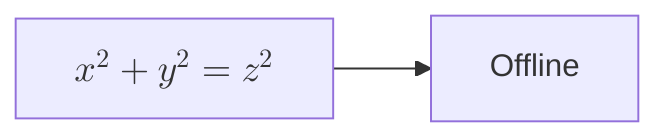
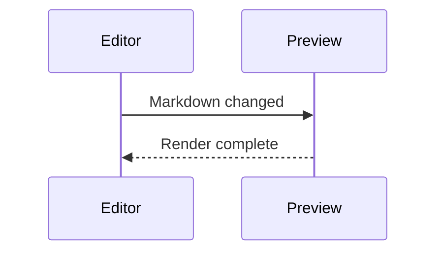
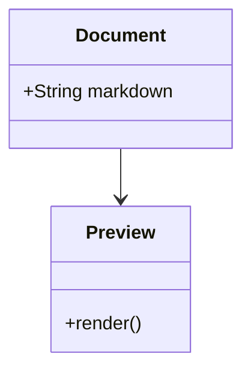

# Diagram compatibility

## Flowchart with math

```mermaid
flowchart LR
  A["$$x^2 + y^2 = z^2$$"] --> B[Offline]
```

## Sequence

```mermaid
sequenceDiagram
  participant Editor
  participant Preview
  Editor->>Preview: Markdown changed
  Preview-->>Editor: Render complete
```

## Classes

```mermaid
classDiagram
  Document --> Preview
  class Document {
    +String markdown
  }
  class Preview {
    +render()
  }
```
